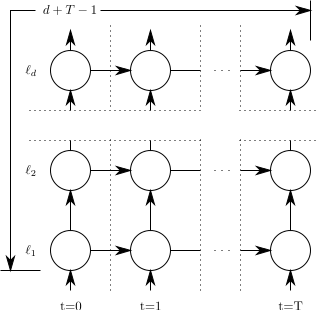
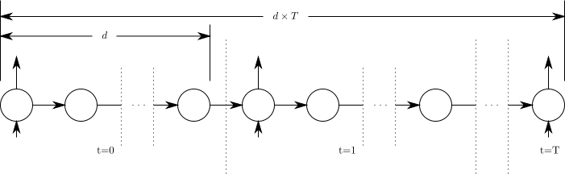

# Recurrent Highway Networks
Note: For Tensorflow 1.0, please use [this branch](https://github.com/julian121266/RecurrentHighwayNetworks/tree/tensorflow_1.0_branch).

*What?*

This repository contains code accompanying the paper [Recurrent Highway Networks](https://arxiv.org/abs/1607.03474 "Recurrent Highway Networks") (RHNs). 
RHNs are an extension of [Long Short Term Memory](http://bioinf.jku.at/publications/older/2604.pdf) Networks with [forget gates](https://pdfs.semanticscholar.org/1154/0131eae85b2e11d53df7f1360eeb6476e7f4.pdf) to enable the learning of deep recurrent state transitions.
We provide implementations in Tensorflow, Torch7 and Brainstorm libraries, and welcome additional implementations from the community.

*Why?*

The recurrent state transition in typical recurrent networks is modeled with a single step non-linear function.
This can be very inefficient in principle for modeling complicated transitions, requiring very large networks.
Increased recurrence depth allows RHNs to model complex transitions more efficiently achieving substantially improved results.

Moreover, using depth d in the recurrent state transition is much more powerful than stacking d recurrent layers.
The figures below illustrate that if we consider the functions mapping one hidden state to another T time steps apart, its maximum depth scales as the product of d and T instead of the sum. 
Of course, in general RHNs can also be stacked to get the best of both worlds.

| Stacked RNN                           | Deep Transition RNN              |
|:-------------------------------------:|:--------------------------------:|
|  |  |

## RHN Benchmarks reproducible with the provided code

### Influence of recurrence depth on performance 
The score (perplexity) of word-level language models on the Penn Treebank dataset dramatically improves as recurrence depth increases _while keeping the model size fixed_.
WT refers to tying the input and output weights for regularization. This idea was independently developed by [Inan and Khosravi](https://cs224d.stanford.edu/reports/InanKhosravi.pdf) and [Press and Wolf](https://arxiv.org/abs/1608.05859). Recently, Inan et al. also posted a more detailed follow-up [paper](https://arxiv.org/abs/1611.01462).

| Rec. depth| #Units/Layer | Best Validation | Test | Best Validation (WT) | Test (WT)|
|:-------------:|:-------------:|:-------------:|:-------------:|:-------------:|:-------------:|
| 1 | 1275 | 92.4 | 89.2 | 93.2 | 90.6 | 
| 2 | 1180 | 79.0 | 76.3 | 76.9 | 75.1 | 
| 3 | 1110 | 75.0 | 72.6 | 72.7 | 70.6 | 
| 4 | 1050 | 73.3 | 70.9 | 70.8 | 68.6 | 
| 5 | 1000 | 72.0 | 69.8 | 69.7 | 67.7 | 
| 6 | 960  | 71.9 | 69.3 | 69.1 | 66.6 | 
| 7 | 920  | 71.7 | 68.7 | 68.7 | 66.4 |
| 8 | 890  | **71.2** | **68.5** | 68.2 | 66.1 | 
| 9 | 860  | 71.3   | 68.5    | **68.1**    |  **66.0**   |
| 10 | 830 | 71.3   | 68.3    | 68.3   |  66.0   |

### Comparison to SOTA language models on Penn Treebank

| Network        |  Size | Best Validation | Test  |
|:-------------|:-------------:|:-------------:|:-------------:|
| [LSTM+dropout](https://arxiv.org/abs/1409.2329)      | 66 M | 82.2 | 78.4 | 
| [Variational LSTM](http://arxiv.org/abs/1512.05287)     | 66 M | 77.3 | 75.0      |
| [Variational LSTM with MC dropout](http://arxiv.org/abs/1512.05287)     | 66 M |  - | 73.4      |
| [Variational LSTM + WT](http://arxiv.org/abs/1608.05859) | 51 M | 75.8 | 73.2 |
| [Pointer Sentinel LSTM](https://arxiv.org/abs/1609.07843) | 21 M | 72.4 | 70.9 |
| [Ensemble of 38 large LSTMs+dropout](https://arxiv.org/abs/1409.2329) | 66 M per LSTM | 71.9 | 68.7  |
| [Ensemble of 10 large Variational LSTMs](https://arxiv.org/abs/1409.2329) | 66 M per LSTM | - | 68.7  |
| [**Variational RHN (depth=8)**](https://arxiv.org/abs/1607.03474 "Recurrent Highway Networks")| 32 M | **71.2** | **68.5** | 
| [**Variational RHN + WT (depth=10)**](https://arxiv.org/abs/1607.03474 "Recurrent Highway Networks") | 23 M |  **67.9**| **65.4**   |
| [**Variational RHN + WT with MC dropout (depth=5)**](https://arxiv.org/abs/1607.03474 "Recurrent Highway Networks")* | 22 M | - | **64.4**| 

*We used 1000 samples for MC dropout as done by Gal for LSTMs, but we've only evaluated the depth 5 model so far.

### Wikipedia (enwik8) next character prediction modeling

| Network        | Network size | Test BPC    |
|:-------------:|:-------------:|:-------------:|
| [Grid-LSTM](http://arxiv.org/abs/1507.01526)  | 16.8 M | 1.47  | 
| [MI-LSTM](https://arxiv.org/abs/1606.06630)      |  17 M | 1.44 |
| [mLSTM](https://arxiv.org/abs/1609.07959) |  21 M | 1.42 |
| [Layernorm HyperNetworks](https://arxiv.org/abs/1609.09106) | 27 M | 1.34 |
| [Layernorm HM-LSTM](http://128.84.21.199/abs/1609.01704)      | 35 M | 1.32      | 
| [**RHN - Rec. depth 5**](https://arxiv.org/abs/1607.03474 "Recurrent Highway Networks") | 23 M | **1.31** | 
| [**RHN - Rec. depth 10**](https://arxiv.org/abs/1607.03474 "Recurrent Highway Networks") | 21 M | **1.30** | 
| [**Large RHN - Rec. depth 10**](https://arxiv.org/abs/1607.03474 "Recurrent Highway Networks") | 46 M | **1.27** | 


### Wikipedia (text8) next character prediction modeling

| Network        | Network size | Test BPC    |
|:-------------:|:-------------:|:-------------:|
| [MI-LSTM](https://arxiv.org/abs/1606.06630)      |  17 M | 1.44 |
| [mLSTM](https://arxiv.org/abs/1609.07959) |  10 M | 1.40 |
| [BN LSTM](https://arxiv.org/abs/1609.09106) | 16 M | 1.36 |
| [HM-LSTM](http://128.84.21.199/abs/1609.01704)      | 35 M | 1.32      | 
| [Layernorm HM-LSTM](http://128.84.21.199/abs/1609.01704)      | 35 M | 1.29      | 
| [**RHN - Rec. depth 10**](https://arxiv.org/abs/1607.03474 "Recurrent Highway Networks") | 20 M | **1.29** | 
| [**Large RHN - Rec. depth 10**](https://arxiv.org/abs/1607.03474 "Recurrent Highway Networks") | 45 M | **1.27** | 

## CODE
### Tensorflow

Tensorflow code for RHNs is built by heavily extending the LSTM language modeling example provided in Tensorflow.
It supports Variational RHNs as used in the paper, which use the same dropout mask at each time step and at all layers inside the recurrence.
Note that this implementation uses the same dropout mask for both the H and T non-linear transforms in RHNs while the Torch7 implementation uses different dropout masks for different transformations. The Theano implementation can be configured either way.

#### Requirements

We recommend [installing Tensorflow in a virtual environment](https://www.tensorflow.org/versions/master/get_started/os_setup.html#virtualenv-installation).
In addition to the usual Tensorflow dependencies, the code uses [Sacred](https://github.com/IDSIA/sacred) so you need to do:

```bash
$ pip install sacred
```
#### Usage

To reproduce SOTA results on Penn Treebank:
```bash
$ python rhn_train.py with ptb_sota
```
To reproduce SOTA results on enwik8/text8 (Wikipedia), first download the dataset from http://mattmahoney.net/dc/enwik8.zip or for text8 http://mattmahoney.net/dc/text8.zip and unzip it into the ```data``` directory, then run:
```bash
$ python rhn_train.py with enwik8_sota
```
or
```bash
$ python rhn_train.py with text8_sota
```

Change some hyperparameters and run:
```bash
$ python rhn_train.py with ptb_sota depth=20
```
This is a Sacred experiment, so you check the hyperparameter options using the ```print_config``` command, e.g.
```bash
$ python rhn_train.py print_config with ptb_sota
```

### Torch7

Torch7 code is based on Yarin Gal's [adaptation](https://github.com/yaringal/BayesianRNN) of Wojciech Zaremba's [code](https://github.com/wojzaremba/lstm) implementing variational dropout. 
The main additions to Gal's code are the Recurrent Highway Network layer, the initial biasing of T-gate activations to facilitate learning and a few adjustments to other network parameters such as ```rnn_size``` and dropout probabilities. 

#### Requirements

We recommend installing Torch from the [official website](http://torch.ch/docs/getting-started.html#_). To ensure the code runs some packages need to be installed:

 ```bash
 $ luarocks install nngraph 
 $ luarocks install cutorch
 $ luarocks install nn
 $ luarocks install hdf5
 ```

#### Usage

```bash
$ th torch_rhn_ptb.lua
```

To run on the enwik8 dataset, first download and prepare the data (see [data/README](./data/README.md) for details): 
```bash
$ cd data
$ python create_enwik8.py
```
Then you can train by running:
```bash
$ th toch_rhn_enwik8.lua
```

### Theano

The Theano code's configuration and usage is similar to that of the Tensorflow code.
In this implementation two configuration options were added: 
* Whether the same dropout masks are used for both the H and T non-linear transforms.
* How all biases other than T's bias are initialized: randomly (as in the Tensorflow implementation) or with zeros (or any other fixed value).

The following isn't implemented:
* MC dropout

#### Requirements

[Theano](http://deeplearning.net/software/theano/install.html) and [Sacred](https://github.com/IDSIA/sacred).

#### Usage

As with the Tensorflow code, the SOTA results on Penn Treebank and on enwik8 (Wikipedia) can be reproduced:
```bash
$ python theano_rhn_train.py with ptb_sota
```
```bash
$ python theano_rhn_train.py with enwik8_sota
```

### Brainstorm

An RHN layer implementation is also provided in [Brainstorm](https://github.com/IDSIA/brainstorm). 
This implementation does not use variational dropout.
It can be used in a Brainstorm experiment by simply importing ```HighwayRNNCoupledGates``` from [brainstorm_rhn.py](./brainstorm_rhn.py).

## Citation

If you use RHNs in your work, please cite us:

```
@article{zilly2016recurrent,
  title="{Recurrent Highway Networks}",
  author={Zilly, Julian Georg and Srivastava, Rupesh Kumar and Koutn{\'\i}k, Jan and Schmidhuber, J{\"u}rgen},
  journal={arXiv preprint arXiv:1607.03474},
  year={2016}
}
```

## License

MIT License.
